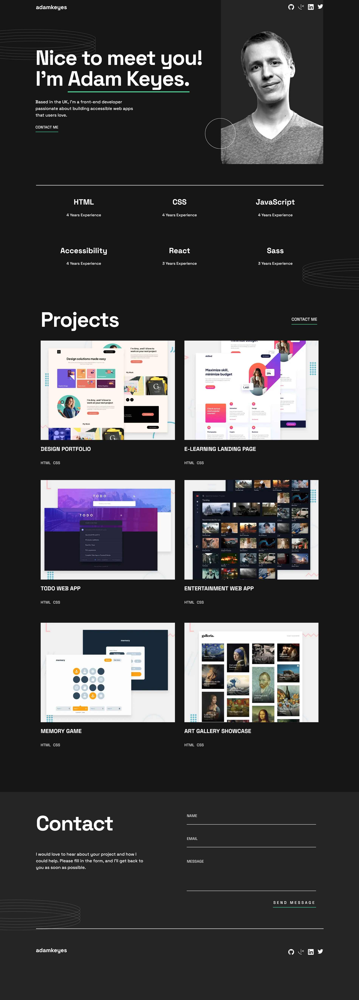

# Frontend Mentor - Single-page developer portfolio solution

This is a solution to the [Single-page developer portfolio challenge on Frontend Mentor](https://www.frontendmentor.io/challenges/singlepage-developer-portfolio-bBVj2ZPi-x). Frontend Mentor challenges help you improve your coding skills by building realistic projects.

## Table of contents

- [Overview](#overview)
  - [Screenshot](#screenshot)
  - [Links](#links)
- [My process](#my-process)
  - [Built with](#built-with)
  - [What I learned](#what-i-learned)
  - [Continued development](#continued-development)
- [Author](#author)

## Overview

### Screenshot

### Links

- [Solution URL:](https://github.com/adriananin/single-page-developer-portfolio)
- [Live Site URL:](https://adriananin.github.io/single-page-developer-portfolio/)

## My process

### Built with

- Semantic HTML5 markup
- CSS custom properties
- Flexbox
- CSS Grid
- Mobile-first workflow

### What I learned

- Planning the layout of the page for all screen sizes before building is essential.
- Button onClick routing.
- Picture tag in HTML for using different images for different screen widths.

### Continued development

- Replacing the images in the project section with iframes of real projects.

## Author

- Website - [Adrian Anin](https://adriananin.github.io/anin-blog-odyssey/)
- Frontend Mentor - [@@adriananin](https://www.frontendmentor.io/profile/adriananin)
